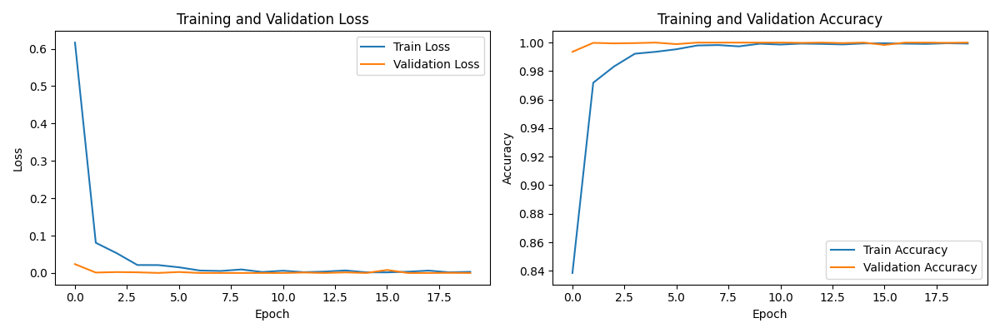

# FERG Database

Late last week, I experimented with the Facial Expression Research Group 2D Database (FERG-DB).  This is a well-curated database of cartoon faces labeled with their corresponding emotions.  I was quickly able to train a model that was 100% accurate.  However, the images in this database are not very cartoonish, making the problem more straightforward than it will be in our case.

    Test Accuracy: 1.0000

    Confusion Matrix:
    [[917   0   0   0   0]
     [  0 857   0   0   0]
     [  0   0 742   0   0]
     [  0   0   0 733   0]
     [  0   0   0   0 762]]

* Model location: /home/feczk001/shared/data/auto_label_emotions/models/ferg00.pth

## Resources

1. [FERG (Facial Expression Research Group Database)](https://paperswithcode.com/dataset/ferg)
2. [Facial Expression Research Group 2D Database (FERG-DB)](https://grail.cs.washington.edu/projects/deepexpr/ferg-2d-db.html)
