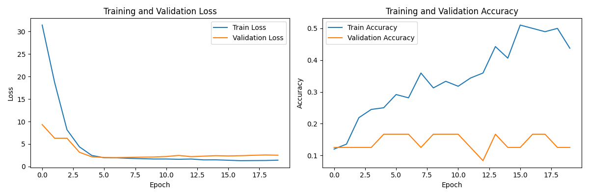

# Pixar Database

I've created a Pixar database of images that is downloaded from the web, [download_character_emotion_images.py](../src/cdni/file_manipulation/download_character_emotion_images.py).  Unfortunately, this database has a lot of problems.  A lot of the emotions are mislabeled.  Sometimes the same image is downloaded for two different emotions.  (This might not actually be a problem since a face can display more than one emotion.)

The test accuracy is 0.1250, which is no better than guessing, since there are eight emotions used.

## Prediction on Pixar database using model trained on FERG database

I tried making predictions on the Pixar database using a model trained on the FERG database.  This model performed only slightly better than chance.

    accuracy: 0.2111111111111111

    cm: [[ 6  9  6  9  6]
         [ 9 12  3  9  3]
         [10  4  8  6  8]
         [ 4 10  1 12  9]
         [ 8 11  5 12  0]]

## Resources
* ['Inside Out': Disney film based on science of facial expressions](https://www.csmonitor.com/Science/2015/0618/Inside-Out-Disney-film-based-on-science-of-facial-expressions)
